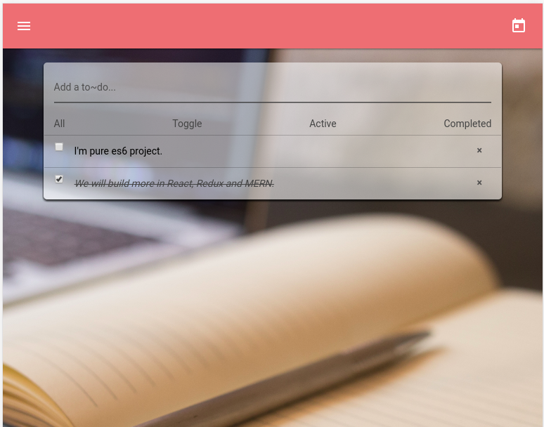
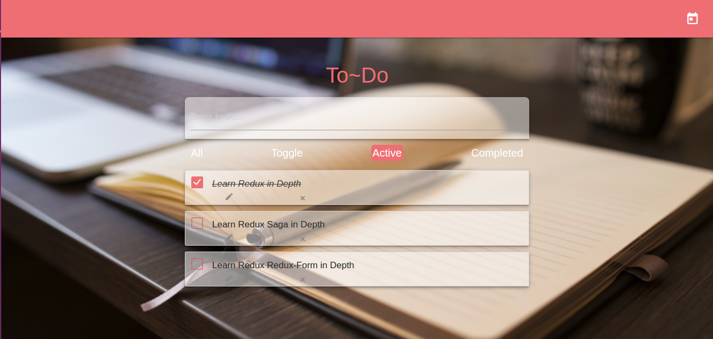
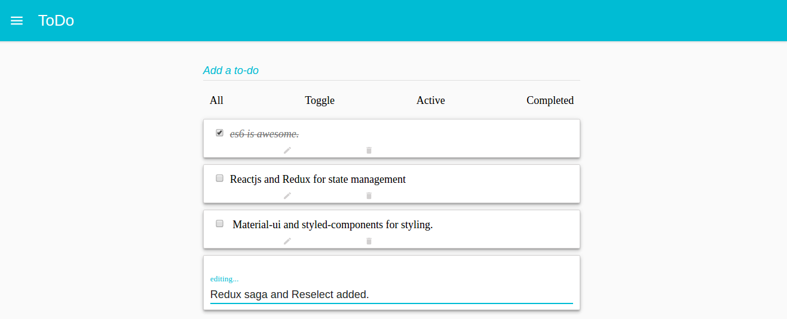

# **:sparkles: Todo-list series :sparkles:**

This a series for javascript projects using different frameworks and libraries.

As the project names suggest, the technologies used in building the project determines the name.

A good example is **Vanilla Todo-list**.



### Framework and libaries used:
* Es6
* Materializecss

### Installation:

```bash
> npm install
> npm start
```

### Other projects on this repository are:

#### **ReactTodo**
* Try it on codepen[Codepen](http://cdpn.io/v/VpaEGo)



### Framework and libaries used:
* Reactjs
* Es6
* Materializecss
* Create-react-app by facebook
* Styled-components
* Browser-sync

### Installation:

```bash
> yarn
> yarn start
```

#### **ReduxReactTodo**



### Framework and libaries used:
* React-Boilerplate
* Reactjs
* Redux
* Styled-components
* Es6
* Material-Ui
* Browser-sync
* react-styled-flexboxgrid

### Installation:

```bash
> yarn
> yarn start
```

* MERNTodo coming soon...


